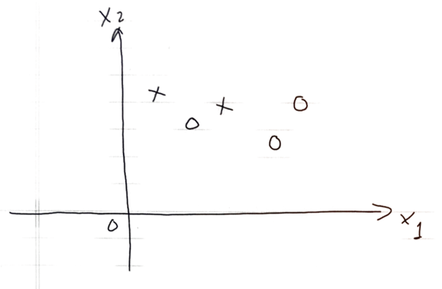

```{r global_options, include=FALSE}
knitr::opts_chunk$set(fig.width=12, fig.height=8, fig.path='Figs/',
                      echo=FALSE, warning=FALSE, message=FALSE)
```

## Problem 1

Decide the best vertical first split for the following dataset.  Impurity can be measured by entropy or Gini-Index.

<center>

</center>

## Problem 2

```{r, echo = FALSE}
library(tidyverse)
ip = function(n0, n1){
  p0 = n0/(n0+n1)
  return(1-p0^2-(1-p0)^2)}

ig = function(a0, a1, b0, b1){
  k = (b0+b1)/(a0+a1)
  return(ip(a0, a1) - k*ip(b0,b1)-(1-k)*ip(a0-b0, a1-b1))}

igg = function(df, v, s)
# df = Data
# v = Index of the Variable to split
# s = Value the variable split at 
  
{
  #set the variable (x1) and the value it splits at(x1==1)
  s1 = table(df[df[,v]==s,]$target)
  tt = table(df$target)
  #calculate the impurity gain of the split
  ig1 = ig(tt[1],tt[2],s1[1],s1[2])
  
  return(ig1)
  
}

Class     =c(1,1,1,1,1,1,1,3,3,2,3,2,2,3,2,3,1,2,1,2)
Sex     =  c(0,0,0,1,0,0,0,1,0,1,0,1,1,1,1,0,0,0,1,1)
target =   c(1,1,1,1,1,1,1,1,1,0,1,0,0,0,0,0,0,0,0,0)
d = as_tibble(cbind(Class, Sex, target))


```

- Given the **training** data.  

<center>
```{r, echo = FALSE}
names(d) = c("Class", "Sex", "Survived")
knitr::kable(d)
```
</center>

Using Gini Index as the measure for impurity to:

1. Grow the **maximum tree** with three leaves (a stopping rule!) on the data.  Draw the (diagram of) tree. 
2. Find the misclassification rate on training data of the maximal tree
3. Draw all the possible **subtrees**
4. Validate the maximal tree and all the subtrees on the following data to select the **optimal tree**. Note: if the chance of Survived is 1/2, predict `Survived`

<center>
```{r, echo = FALSE}
knitr::kable(as_tibble(data.frame(Class=c(1,1,3,2), Sex =c(0,1,1,0), Survived =c(1,1,0,0))))
```
</center>


