```{r global_options, include=FALSE}
knitr::opts_chunk$set(fig.width=12, fig.height=8, fig.path='Figs/',
                      echo=FALSE, warning=FALSE, message=FALSE)
```

This provides a similar solution for Problem 2 in [Exam 1](Exam1.html). 

# Problem

```{r, echo = FALSE}
library(tidyverse)
ip = function(n0, n1){
  p0 = n0/(n0+n1)
  return(1-p0^2-(1-p0)^2)}

ig = function(a0, a1, b0, b1){
  k = (b0+b1)/(a0+a1)
  return(ip(a0, a1) - k*ip(b0,b1)-(1-k)*ip(a0-b0, a1-b1))}

# children impurity

ic <- function(a, b, c, d)
{
  n = a + b + c + d
  n_l = a + b
  n_r = c + d
  
  i_c = (n_l/n)*(2*a*b)/(a+b)^2 + (n_r/n)*(2*c*d)/(c+d)^2
  return(i_c)
}

igg = function(df, v, s)
# df = Data
# v = Index of the Variable to split
# s = Value the variable split at 
  
{
  #set the variable (x1) and the value it splits at(x1==1)
  s1 = table(df[df[,v]==s,]$target)
  tt = table(df$target)
  #calculate the children impurity of the split
  ig1 = ig(tt[1],tt[2],s1[1],s1[2])
  
  return(ig1)
  
}

x1     =c(1,1,1,1,1,1,1,1,3,2,3,2,2,3,2,3,3,2,1,2)

x2     =c(0,0,0,0,0,0,0,1,0,1,0,1,1,1,1,0,1,0,1,1)
target =c(1,1,1,1,1,1,1,1,1,1,1,0,0,0,0,0,0,0,0,0)

d = as_tibble(cbind(x1, x2, target))


d1 = d %>% filter(x1==1)
d2 = d %>% filter(x1!=1)

```

- Given the **training** data. Using Gini Index as the measure for impurity to: 

<center>
```{r, echo = FALSE}
names(d) = c("Class", "Sex", "Survived")
knitr::kable(d)
```
</center>

1. Grow the **maximum tree** with four leaves (a stopping rule!) on the data.  Draw the (diagram of) tree. 
2. Find the misclassification rate on training data of the maximal tree
3. Draw all the candidate **subtrees**
4. Validate the maximal tree and the subtrees on the following data to select the **optimal tree**. Note: if the chance of Survived is 1/2, predict `Survived`

<center>
```{r, echo = FALSE}
knitr::kable(as_tibble(data.frame(Class=c(1,1,3,2), Sex =c(0,1,1,0), Survived =c(1,1,0,0))))
```
</center>

# Solution

### Step 1: Decide the first split

We need to find the children impurity of all candidate splits for the first.  What are candidate first splits? Here are all candidate first splits:

- Split 1:  Split Sex into Male and Female
- Split 2:  Split Class into class 1 and class 2,3 
- Split 3:  Split Class into class 2 and class 1,3 
- Split 4:  Split Class into class 3 and class 1,2 

All of this splits have the same parent node.  The impurity of the parent is 

$$
I_{parent} = 1 - (\frac{9}{20})^2-(\frac{11}{20})^2=0.495
$$

#### Split 1: 
<center>
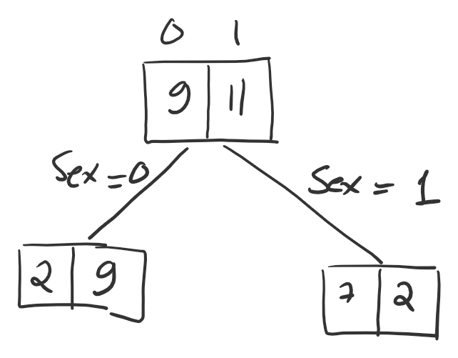

The children impurity of Split 1: 0.3191919.  The impurity gain of the split is: 0.495-0.3191919 = 0.1758081

</center>

#### Split 2: 
<center>
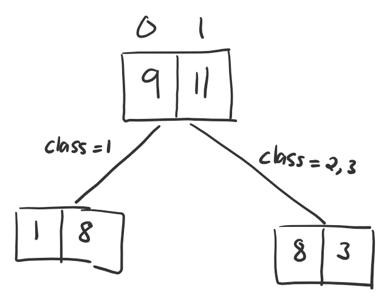

The children impurity of Split 2: 0.3070707. The impurity gain of the split is: 0.495-0.3070707 = 0.1879293

</center>

#### Split 3: 
<center>
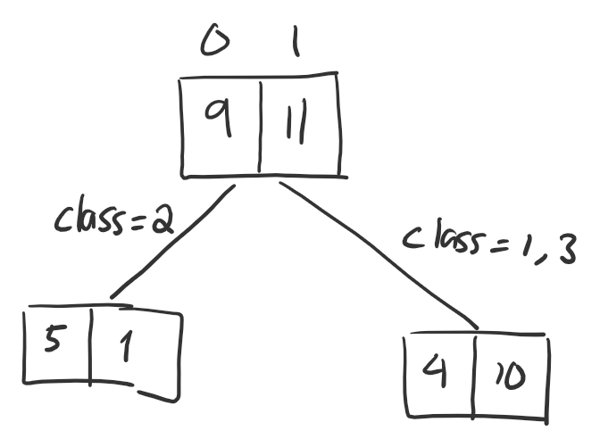

The children impurity of Split 3: 0.3690476. The impurity gain of the split is: 0.495-0.3690476 = 0.1259524

</center>

#### Split 4: 
<center>
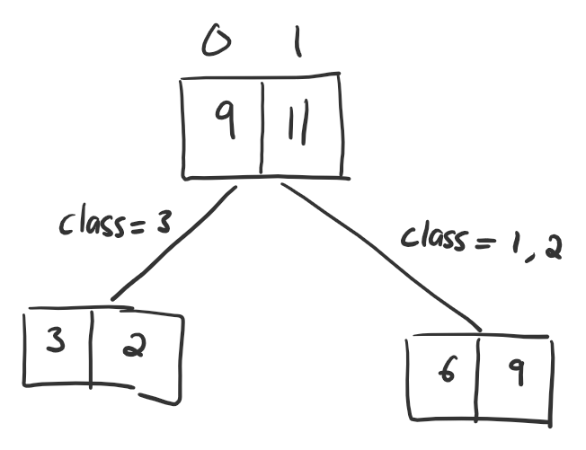

The children impurity of Split 4: 0.48. The impurity gain of the split is: 0.495-0.48 = 0.015

</center>


<center>


| Split |Parent Impurity| Children impurity     |Impurity Gain|
|-------|-------------------|-------------------|-------------------|
| 1     |0.495|   0.3191919   |0.1758081|
| 2     |0.495| 0.3070707 |0.1879293|
| 3     | 0.495|     0.3690476|    0.1259524   |
| 4     | 0.495 |    0.48      | 0.015 |

The best split is the split with the highest impurity gain. Thus, split 2 is the first slit of the tree.  
</center>

We have the first Split as follow
<center>
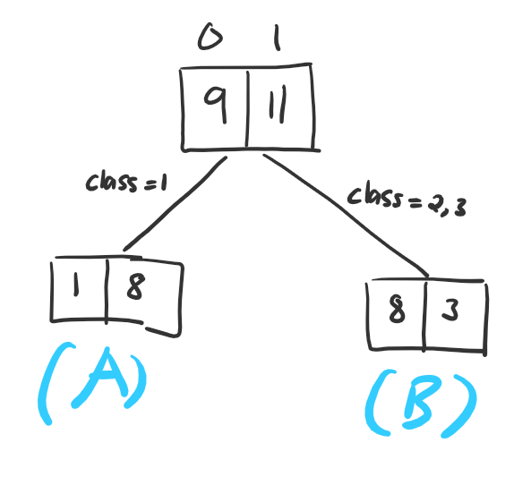
</center>

### Step 2: Decide the second split

The next split could happen at a split at node A or node B

Let's look at the data in node A (Class = 1): 

<center>
```{r, echo = FALSE}
knitr::kable(d[d$Class==1,])
```
</center>

What are candidate splits at node A? The only candidate split at Node A is splitting at Sex. 

Let's look at the data in node B (Class = 2, 3): 

<center>
```{r, echo = FALSE}
knitr::kable(d[d$Class!=1,])
```
</center>

Node B can be splittted at Sex and Class

Therefore, the candidates splits for the second split are

- Split node A at Sex 
- Split node B at Sex  
- Split node B at Class 

We will compute the children impurity of all the candidate splits.


#### Splitting node A at Sex: 

<center>
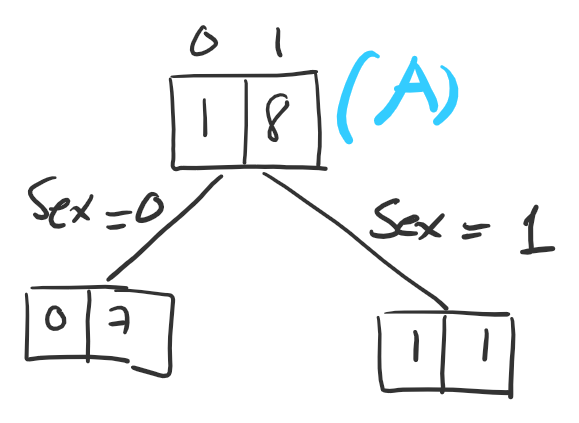
</center>

The children impurity of this split: 0.1111111. 

$$
I_{parent}=1-(\frac{1}{8})^2-(\frac{7}{8})^2=0.1975309
$$

The impurity gain of the split is 0.1975309 - 0.1111111 = 0.0864198

#### Splitting node B at Sex: 

<center>
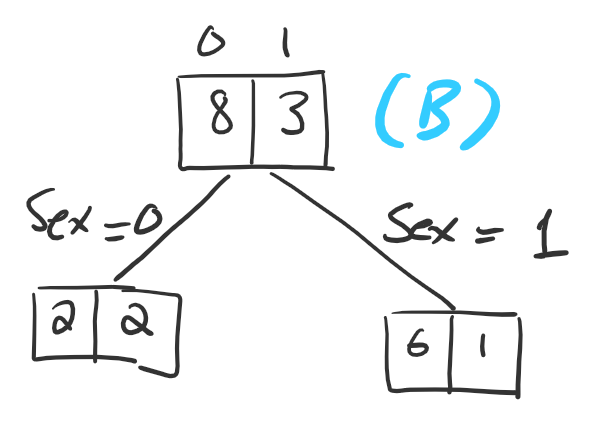
</center>

$$
I_{parent}=1-(\frac{3}{11})^2-(\frac{8}{11})^2=0.3966942
$$

The children impurity of this split: 0.3376623. 
The impurity gain of the split is 0.3966942 - 0.3376623 = 0.0590319

#### Splitting node B at Class: 

<center>
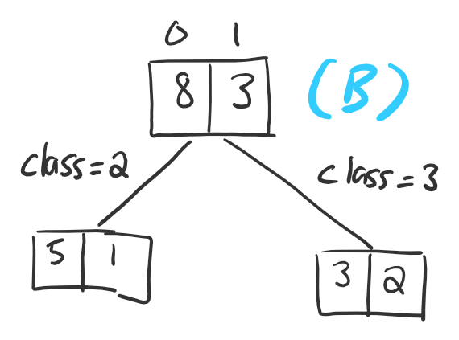
</center>


$$
I_{parent}=1-(\frac{3}{11})^2-(\frac{8}{11})^2=0.3966942
$$

The children impurity of this split: 0.369697. The impurity gain of the split is 0.3966942 - 0.369697 = 0.0269972


<center>


| Candidate Split |Parent Impurity| Children impurity     |Impurity Gain|
|-------|-------------------|-------------------|-------------------|
| Split node A at Sex     | 0.1975309|    0.1111111         |0.0864198|
| Split node B at Sex     |0.3966942 |  0.3376623 |0.0590319|
| Split node B at Class    | 0.3966942 |   0.369697 | 0.0269972        |

The best split is the split with the highest impurity gain. Thus, the second split is splitting node A at Sex
</center>


Update the tree

<center>
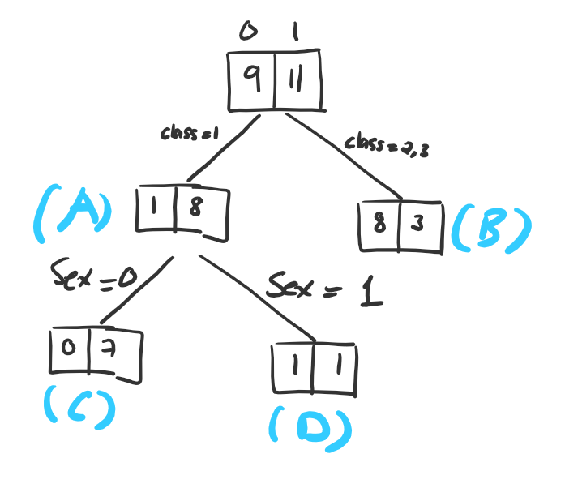
</center>
 
### Step 3: Decide the third split

<center>

</center>

The third split cannot be at node C and D because the variable Sex and Class are constant in these nodes. (Node C: Sex=0 and Class=1 and Node D: Sex=1, Class=1).  There fore The third split has to be in node B. 

In Step 2, we already that nodes B can be splitted in two ways and the one with higher impurity is the split at Sex. Therefore, the third split is splitting node B at Sex

We obtain the maximal tree as follow. 

Maximal Tree
<center>
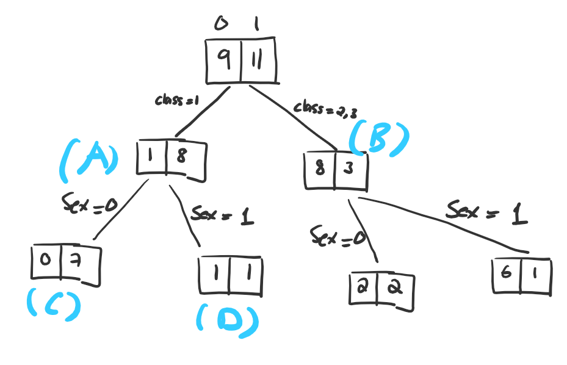
</center>

## 2. Misclassification Rate

<center>

</center>
 
The prediction of each leaf is the majority.  Thus, the misclassification of a leaf is the minority in the leaf. 

- Total misclassification is: 0+1+2+1 =4
- Misclassification Rate is 4/20 = 20%

## 3. Subtrees

There are three subtrees that can be prunned from the maximal tree

### Subtree 1

<center>
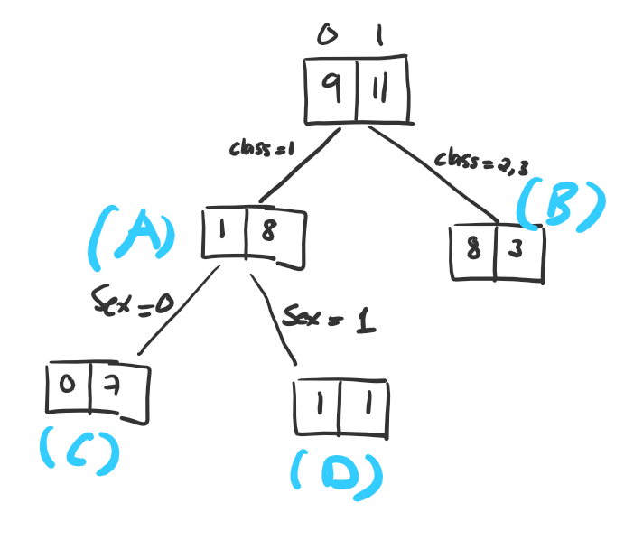
</center>

### Subtree 2

<center>
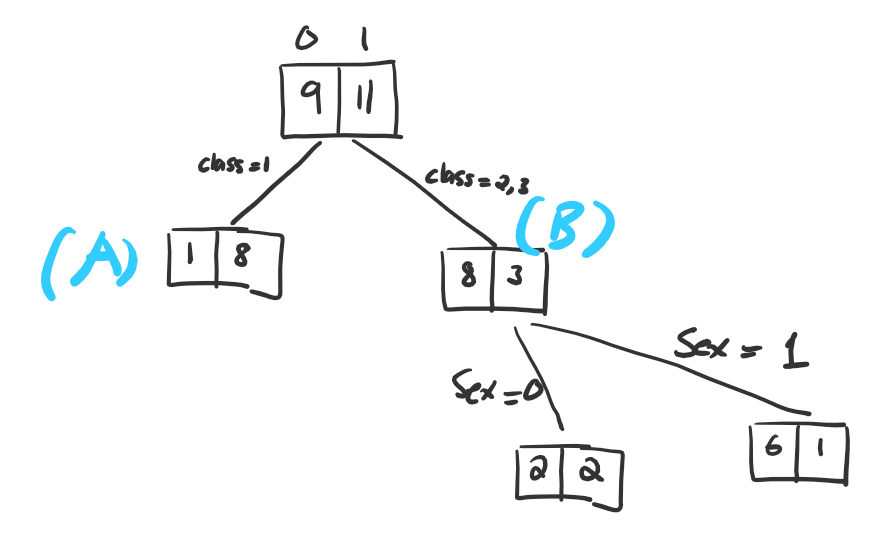
</center>

### Subtree 3

<center>
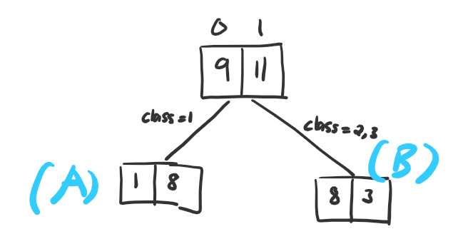
</center>


## 4. Optimal Tree

Predictions of all the subtrees and the maximal tree

<center>
```{r, echo = FALSE}
v = as_tibble(data.frame(Class=c(1,1,3,2), Sex =c(0,1,1,0), Survived =c(1,1,0,0), 'S1' = c(1,1,0,0), 'S2' = c(1,1,1,0), 'S3' = c(1,1,0,0), 'S4' = c(1,1,1,0)))

names(v)[4:7] = c('Subtree1 Predicts','Subtree2 Predicts','Subtree3 Predicts','Maximal Tree Predicts')
```
| Class | Sex | Survived | Subtree1 Predicts | Subtree2 Predicts | Subtree3 Predicts | Maximal Tree Predicts |
|-------|-----|----------|-------------------|-------------------|-------------------|-----------------------|
| 1     | 0   | 1        | 1                 | 1                 | 1                 | 1                     |
| 1     | 1   | 1        | 1                 | 1                 | 1                 | 1                     |
| 3     | 1   | 0        | 0                 | 1 (Missed!)       | 0                 | 1(Missed)             |
| 2     | 0   | 0        | 0                 | 0                 | 0                 | 0                     |


</center>

- We see that Subtree 1 and Subtree 3 both have perfect predictions! (0 misclassification)
- Since Subtree 3 has less leaves than subtree 1, it is simpler than subtree 3. 
- We select Subtree 3 as the optimal tree

Winning Model! 
<center>


</center>
