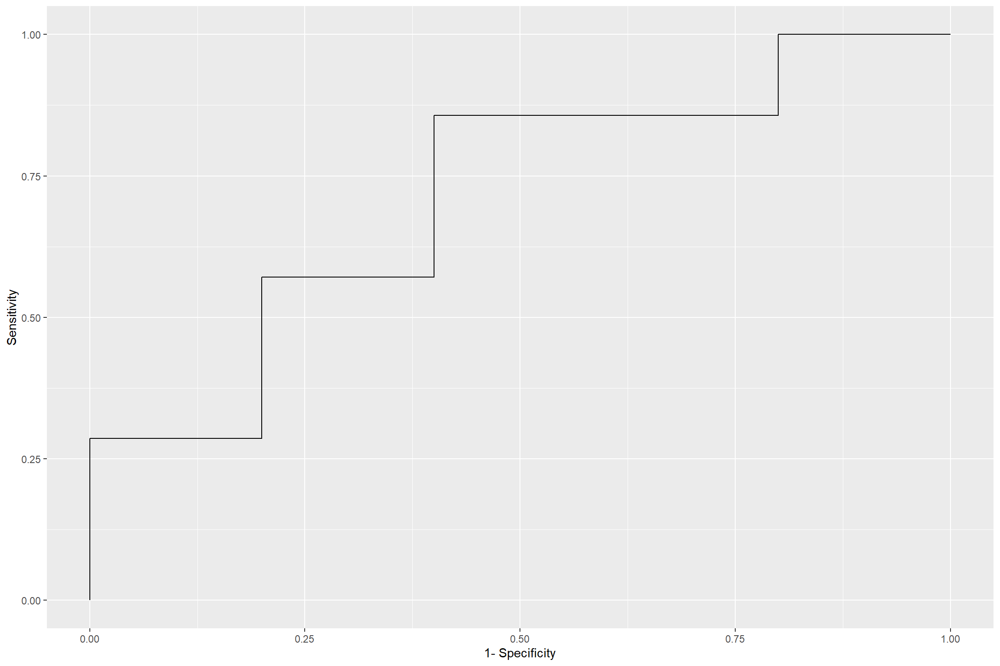
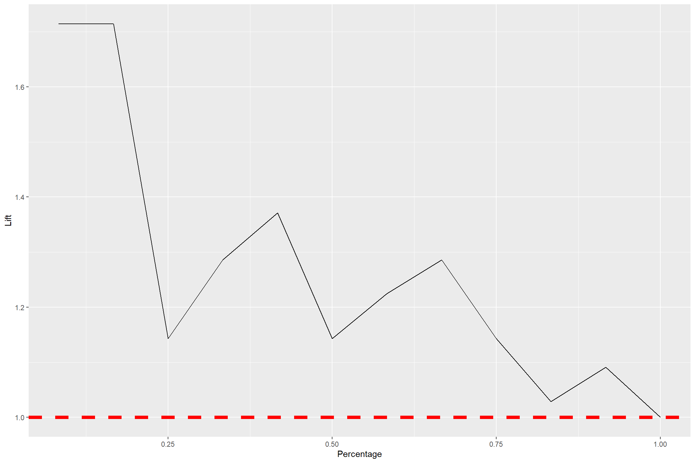
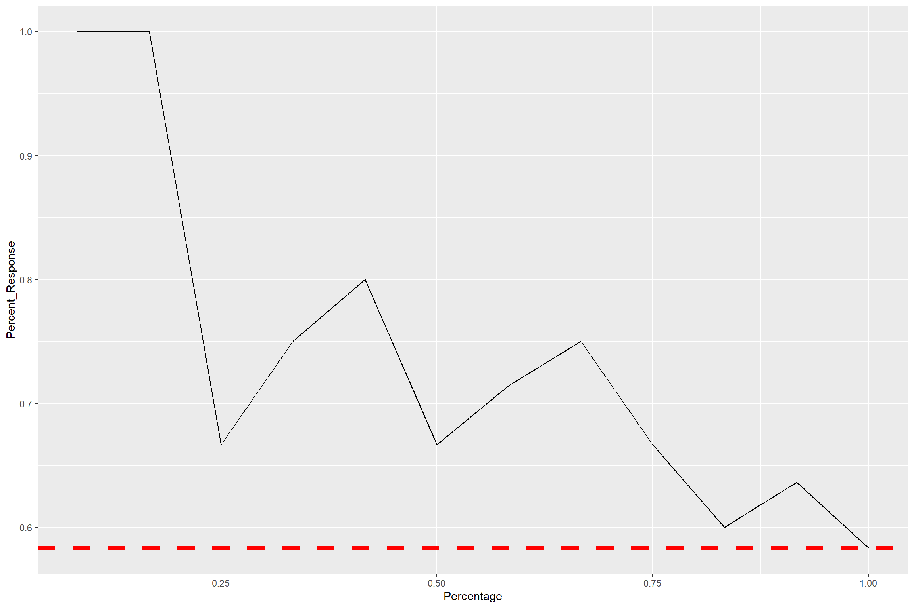
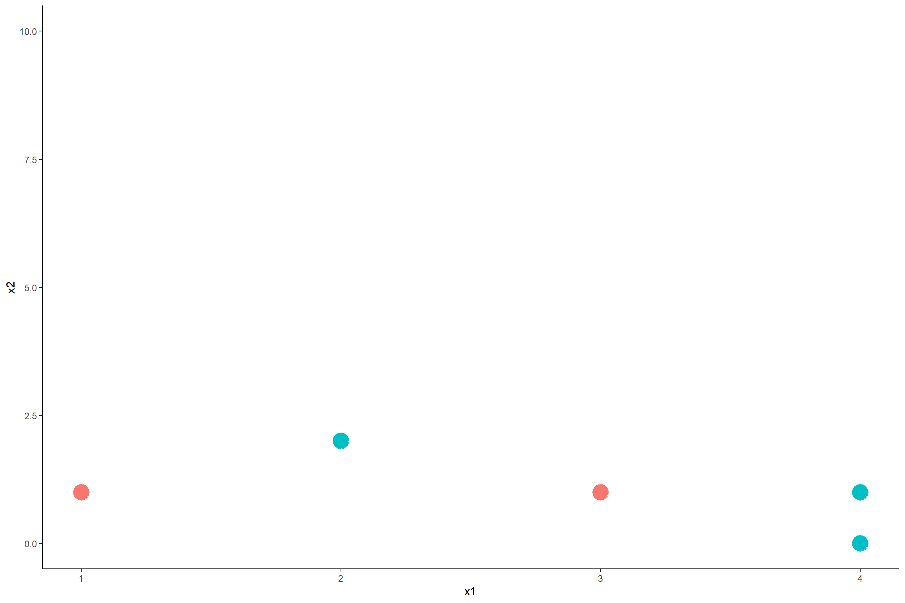
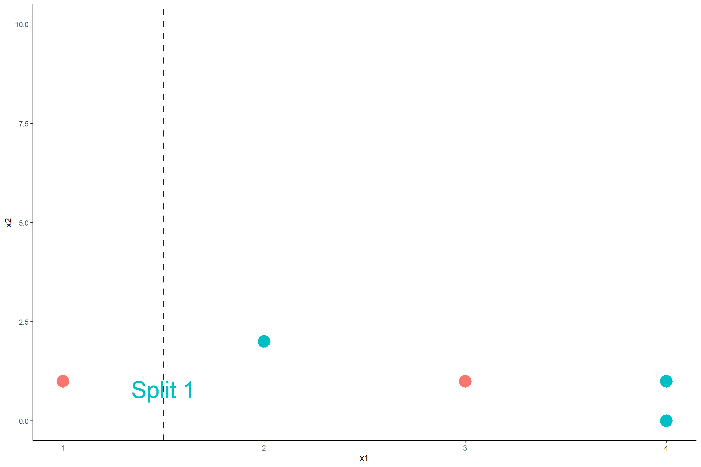
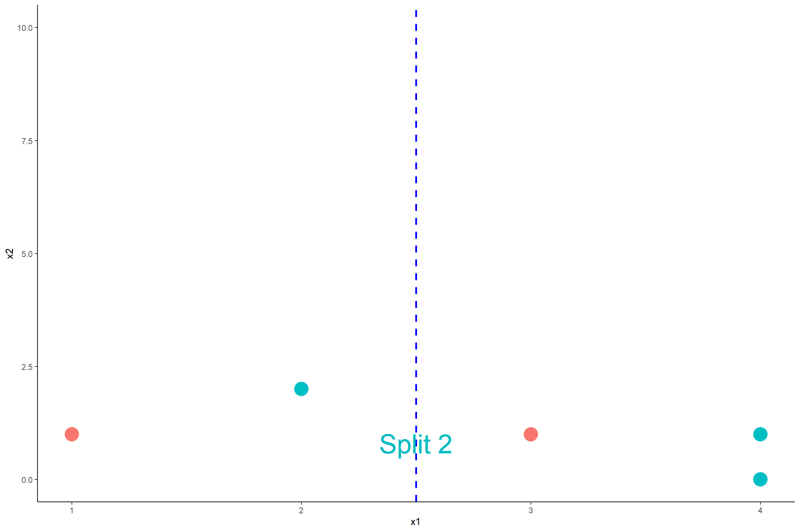
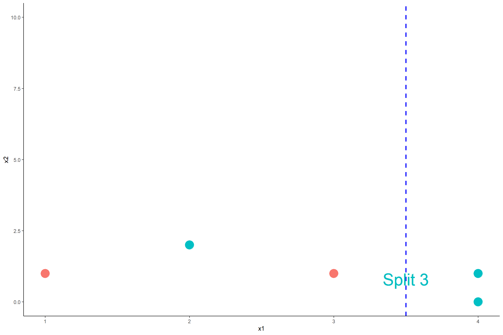

# Problem 1. 
Given outcomes of a predictive model: 

|    Passenger ID    |    Probability of Survived    |    Truth           |
|--------------------|-------------------------------|--------------------|
|    1               |    0.55                       |    Survived        |
|    2               |    0.2                        |    Survived        |
|    3               |    0.94                       |    Survived        |
|    4               |    0.63                       |    Not Survived    |
|    5               |    0.9                        |    Survived        |
|    6               |    0.35                       |    Not Survived    |
|    7               |    0.84                       |    Not Survived    |
|    8               |    0.38                       |    Not Survived    |
|    9               |    0.01                       |    Not Survived    |
|    10              |    0.68                       |    Survived        |
|    11              |    0.71                       |    Survived        |
|    12              |    0.45                       |    Survived        |

a.	Form the confusion matrix when the cutoff value for positive outcome is c=0.5.  Calculate the sensitivity, specificity, precision, and F1-Score when c = 0.5
b.	Sketch the ROC curve.
c.	Sketch and interpret the Cumulative Lift
d.	Sketch the Cumulative % Response

Solution
=======================================================

a. Confusion Matrices

|                 | Predicted Positive | Predicted Negative |
|-----------------|--------------------|--------------------|
| __Actual Positive__ |  TP = 5         |  FN = 2        |
| __Actual Negative__ |   FP = 2     |    TN = 3        | 

\begin{aligned}
\text{Misclassification Rate} &=4/12 \\
\text{Accuracy} &= 8/12 \\
\text{Sensitivity} &= 5/7 \\ 
\text{Specificity} & = 3/5 \\
\text{Precision} &= 5/7 \\
\text{F1-Score} &= 5/7

\end{aligned}

b. ROC Curve

| Order| Predicted Probabilities| True Values|
|-----:|-----------------------:|-----------:|
|     1|                    0.94|           1|
|     2|                    0.90|           1|
|     3|                    0.84|           0|
|     4|                    0.71|           1|
|     5|                    0.68|           1|
|     6|                    0.63|           0|
|     7|                    0.55|           1|
|     8|                    0.45|           1|
|     9|                    0.38|           0|
|    10|                    0.35|           0|
|    11|                    0.20|           1|
|    12|                    0.01|           0|

|Cut-off Values | Sensitivity| Specificity|
|:--------------|-----------:|-----------:|
|c = 0          |   1.0000000|         0.0|
|c = 0.1        |   1.0000000|         0.2|
|c = 0.2        |   0.8571429|         0.2|
|c = 0.3        |   0.8571429|         0.2|
|c = 0.4        |   0.8571429|         0.6|
|c = 0.5        |   0.7142857|         0.6|
|c = 0.6        |   0.5714286|         0.6|
|c = 0.7        |   0.4285714|         0.8|
|c = 0.8        |   0.2857143|         0.8|
|c = 0.9        |   0.1428571|         1.0|
|c = 1          |   0.0000000|         1.0|

c. Cumulative Lift 

| Percentage|     Lift|
|----------:|--------:|
|  0.0833333| 1.714286|
|  0.1666667| 1.714286|
|  0.2500000| 1.142857|
|  0.3333333| 1.285714|
|  0.4166667| 1.371429|
|  0.5000000| 1.142857|
|  0.5833333| 1.224490|
|  0.6666667| 1.285714|
|  0.7500000| 1.142857|
|  0.8333333| 1.028571|
|  0.9166667| 1.090909|
|  1.0000000| 1.000000|

d. Cumulative % Response 

| Percentage| Percent_Response|
|----------:|----------------:|
|  0.0833333|        1.0000000|
|  0.1666667|        1.0000000|
|  0.2500000|        0.6666667|
|  0.3333333|        0.7500000|
|  0.4166667|        0.8000000|
|  0.5000000|        0.6666667|
|  0.5833333|        0.7142857|
|  0.6666667|        0.7500000|
|  0.7500000|        0.6666667|
|  0.8333333|        0.6000000|
|  0.9166667|        0.6363636|
|  1.0000000|        0.5833333|

# Problem 2
Given the data points. Calculate the impurity gain of all possible splits by (1) Classification Errors, (2) Gini Index and (3) Entropy. Decide the best split based on each measure.

Solution
=======================================================

### (1) IG By Classification Error:

- Let **green** and **red** be class 0 and class 1, respectively.

**IG By Classification Error of Split 1**

- For this split:  $N = 5, N_{left} =1, N_{right} = 4$

- Node *parent,* A:  $p_0 = \frac{2}{5}, p_1 = \frac{3}{5}$.  Thus, $I_{A} = \text{min}(\frac{2}{5}, \frac{3}{5}) = \frac{2}{5}$

- Node *child left,* L:  $p_0 = \frac{0}{1} = 0, p_1 = \frac{1}{1} = 1$.  Thus, $I_{L} = \text{min}(0, 1) = 0$

- Node *child right,* R:  $p_0 = \frac{3}{4}, p_1 = \frac{1}{4}$.  Thus, $I_{R} = \text{min}(\frac{3}{4}, \frac{1}{4}) = \frac{1}{4}$

- Impurity Gain of Split 1 By Classification Error: 

$$IG = \frac{2}{5} - \frac{1}{5} \cdot 0-\frac{4}{5} \cdot \frac{1}{4} = 0.2$$

**IG By Classification Error of Split 2**

- $N = 5, N_{left} =2, N_{right} = 3$

- Node *parent,* A:  $p_0 = \frac{2}{5}, p_1 = \frac{3}{5}$.  Thus, $I_{A} = \text{min}(\frac{2}{5}, \frac{3}{5}) = \frac{2}{5}$

- Node *child left,* L:  $p_0 = \frac{1}{2}, p_1 = \frac{1}{2}$.  Thus, $I_{L} = \frac{1}{2}$

- Node *child right,* R:  $p_0 = \frac{2}{3}, p_1 = \frac{1}{3}$.  Thus, $I_{R} = \text{min}(\frac{2}{3}, \frac{1}{3}) = \frac{1}{3}$

- Impurity Gain of Split 2: 

$$IG = \frac{2}{5} - \frac{2}{5} \cdot \frac{1}{2}-\frac{3}{5} \cdot \frac{1}{3} = 0$$

**IG By Classification Error of Split 3**

For Split 3:  $N = 5, N_{left} =3, N_{right} = 2$

- Node *parent,* A:  $p_0 = \frac{2}{5}, p_1 = \frac{3}{5}$.  Thus, $I_{A} = \text{min}(\frac{2}{5}, \frac{3}{5}) = \frac{2}{5}$

- Node *child left,* L:  $p_0 = \frac{1}{3}, p_1 = \frac{2}{3}$.  Thus, $I_{A} = \text{min}(\frac{1}{3}, \frac{2}{3}) = \frac{1}{3}$

- Node *child right,* R:  $p_0 = \frac{2}{2}, p_1 = \frac{0}{2}$.  Thus, $I_{R} = \text{min}(1,0) = 0$

- Impurity Gain of Split 3: 

$$IG = \frac{2}{5} - \frac{3}{5} \cdot \frac{1}{3}-\frac{2}{5} \cdot 0 = 0.2$$

**Comparing IG By Classification Error**

|         | IG        |
|---------|-----------|
| Split 1 | 0.2 |
| Split 2 | 0 |
| Split 3 | 0.2          |

By classification error, Split 1 and Split 3 are tie as the best because they have the same impurity gain. 

### (2) IG By Gini Index

For Split 1:  $N = 5, N_{left} =1, N_{right} = 4$

- Node *parent,* A:  $p_0 = \frac{2}{5}, p_1 = \frac{3}{5}$.  Thus, $I_{A} = 1 - (\frac{2}{5})^2-(\frac{3}{5})^2 = 0.48$

- Node *child left,* L:  $p_0 = \frac{0}{1} = 0, p_1 = \frac{1}{1} = 1$.  Thus, $$I_{L} = 1 -0^2-1^2 = 0$$

- Node *child right,* R:  $p_0 = \frac{3}{4}, p_1 = \frac{1}{4}$.  Thus, $$I_{R} = 1-(\frac{3}{4})^2-(\frac{1}{4})^2 = 0.375$$

- Impurity Gain of Split 1: 

$$IG = 0.48 - \frac{1}{5} \cdot 0-\frac{4}{5} \cdot 0.375 = 0.18$$

For Split 2:  $N = 5, N_{left} =2, N_{right} = 3$

- Node *parent,* A:  $p_0 = \frac{2}{5}, p_1 = \frac{3}{5}$.  Thus, $I_{A} = 1-(\frac{2}{5})^2- (\frac{3}{5})^2 = 0.48$

- Node *child left,* L:  $p_0 = \frac{1}{2}, p_1 = \frac{1}{2}$.  Thus, $I_{L} = 1- (\frac{1}{2})^2-(\frac{1}{2})^2=0.5$

- Node *child right,* R:  $p_0 = \frac{2}{3}, p_1 = \frac{1}{3}$.  Thus, $I_{R} = 1-(\frac{2}{3})^2 -(\frac{1}{3})^2 = 0.44$

- Impurity Gain of Split 2: 

$$IG = 0.48 - \frac{2}{5} \cdot \frac{1}{2}-\frac{3}{5} \cdot 0.44 = 0.016$$

For Split 3:  $N = 5, N_{left} =3, N_{right} = 2$

- Node *parent,* A:  $I_{A} = 0.48$

- Node *child left,* L:  $p_0 = \frac{1}{3}, p_1 = \frac{2}{3}$.  Thus, $I_{A} = 1-(\frac{1}{3})^2 -(\frac{2}{3})^2 = 0.44$

- Node *child right,* R:  $p_0 = \frac{2}{2}, p_1 = \frac{0}{2}$.  Thus, $I_{R} = 1-0^2-1^2 = 0$

- Impurity Gain of Split 3: 

$$IG = 0.48 - \frac{3}{5} \cdot 0.44 - \frac{2}{5} \cdot 0 = 0.216$$

Comparing IG By Gini Index

|         | IG        |
|---------|-----------|
| Split 1 | 0.18 |
| Split 2 | 0.016 |
| Split 3 | 0.216          |

By Gini Index, Split 3 is the best because it has the greatest impurity gain. 

### (3) IG By Entropy

For Split 1:  $N = 5, N_{left} =1, N_{right} = 4$

- Node *parent,* A:  $p_0 = \frac{2}{5}, p_1 = \frac{3}{5}$.  Thus, $I_{A} = - log_2(\frac{2}{5})-log_2(\frac{3}{5}) = 0.971$

- Node *child left,* L:  $p_0 = \frac{0}{1} = 0, p_1 = \frac{1}{1} = 1$.  Thus, $I_{L} = 0$

- Node *child right,* R:  $p_0 = \frac{3}{4}, p_1 = \frac{1}{4}$.  Thus, $$I_{R} = -log_2(\frac{3}{4})-log_2(\frac{1}{4}) = 0.811$$

- Impurity Gain of Split 1: 

$$IG = 0.971 - \frac{1}{5} \cdot 0-\frac{4}{5} \cdot 0.811 = 0.322$$

For Split 2:  $N = 5, N_{left} =2, N_{right} = 3$

- Node *parent,* A:  $p_0 = \frac{2}{5}, p_1 = \frac{3}{5}$.  Thus, $I_{A} = 0.971$

- Node *child left,* L:  $p_0 = \frac{1}{2}, p_1 = \frac{1}{2}$.  Thus, $I_{L} = - log_1(\frac{1}{2})-log_2(\frac{1}{2})=1$

- Node *child right,* R:  $p_0 = \frac{2}{3}, p_1 = \frac{1}{3}$.  Thus, $I_{R} = -log_2(\frac{2}{3}) -log_2(\frac{1}{3}) = 0.918$

- Impurity Gain of Split 2: 

$$IG = 0.971 - \frac{2}{5} \cdot 1-\frac{3}{5} \cdot 0.918 = 0.02$$

For Split 3:  $N = 5, N_{left} =3, N_{right} = 2$

- Node *parent,* A:  $I_{A} = 0.971$

- Node *child left,* L:  $p_0 = \frac{1}{3}, p_1 = \frac{2}{3}$.  Thus, $I_{A} = -log_2(\frac{1}{3}) -log_2(\frac{2}{3}) = 0.918$

- Node *child right,* R:  $p_0 = \frac{2}{2}, p_1 = \frac{0}{2}$.  Thus, $I_{R} = 0$

- Impurity Gain of Split 3: 

$$IG = 0.971 - \frac{3}{5} \cdot 0.918 - \frac{2}{5} \cdot 0 = 0.42$$

Comparing IG By Entropy

|         | IG        |
|---------|-----------|
| Split 1 | 0.322 |
| Split 2 | 0.02 |
| Split 3 | 0.42          |

By Gini Index, Split 3 is the best because it has the greatest impurity gain. 

# Problem 3. 
Compute the Chi-square values of all possible splits in Problem 2 then decide the best split based on this measure.

### For Split 1

|              | Greens | Reds |   |
|--------------|--------|------|---|
| Left Branch  | 0 (Cell 1)     | 1 (Cell 2)    | 1 |
| Right Branch | 3  (Cell 3)    | 1  (Cell 4)   | 4 |
|              | 3      | 2    |   |

$$\chi^2 = \frac{(e_1-o_1)^2}{e_1}+\frac{(e_2-o_2)^2}{e_2}+\frac{(e_3-o_3)^2}{e_3}+\frac{(e_4-o_4)^2}{e_4}$$

- $i=1$ (Cell 1): $e_1 = \frac{1\cdot 3}{5}$, $o_1 = 0$
- $i=2$ (Cell 2): $e_2 = \frac{1\cdot 2}{5}$, $o_2 = 1$
- $i=3$ (Cell 3): $e_3 = \frac{3\cdot 4}{5}$, $o_3 = 3$
- $i=4$ (Cell 4): $e_4 = \frac{2\cdot 4}{5}$, $o_4 = 1$

- Plug in, we have: 
$$\chi^2 = 1.875$$

### For Split 2

|              | Greens | Reds |   |
|--------------|--------|------|---|
| Left Branch  | 1 (Cell 1)     | 1 (Cell 2)    | 2 |
| Right Branch | 2  (Cell 3)    | 1  (Cell 4)   | 3 |
|              | 3      | 2    |   |

$$\chi^2 = \frac{(e_1-o_1)^2}{e_1}+\frac{(e_2-o_2)^2}{e_2}+\frac{(e_3-o_3)^2}{e_3}+\frac{(e_4-o_4)^2}{e_4}$$

- $i=1$ (Cell 1): $e_1 = \frac{2\cdot 3}{5}$, $o_1 = 1$
- $i=2$ (Cell 2): $e_2 = \frac{2\cdot 2}{5}$, $o_2 = 1$
- $i=3$ (Cell 3): $e_3 = \frac{3\cdot 3}{5}$, $o_3 = 2$
- $i=4$ (Cell 4): $e_4 = \frac{3\cdot 2}{5}$, $o_4 = 1$

- Plug in, we have: 
$$\chi^2 = 0.139$$

### For Split 3

|              | Greens | Reds |   |
|--------------|--------|------|---|
| Left Branch  | 1 (Cell 1)     | 2 (Cell 2)    | 3 |
| Right Branch | 2  (Cell 3)    | 0  (Cell 4)   | 2 |
|              | 3      | 2    |   |

$$\chi^2 = \frac{(e_1-o_1)^2}{e_1}+\frac{(e_2-o_2)^2}{e_2}+\frac{(e_3-o_3)^2}{e_3}+\frac{(e_4-o_4)^2}{e_4}$$

-  (Cell 1): $e_1 = \frac{2\cdot 3}{5}$, $o_1 = 1$
-  (Cell 2): $e_2 = \frac{2\cdot 2}{5}$, $o_2 = 2$
-  (Cell 3): $e_3 = \frac{3\cdot 3}{5}$, $o_3 = 2$
-  (Cell 4): $e_4 = \frac{3\cdot 2}{5}$, $o_4 = 0$

- Plug in, we have: 
$$\chi^2 = 2.222$$

### Comparing the three splits

|         | $\chi^2$        |
|---------|-----------|
| Split 1 | 1.875 |
| Split 2 | 0.139 |
| Split 3 | 2.222          |

Split 3 is the best because it has the greatest $\chi^2$!

# Problem 4-7: [Classification Tree Practice Problem]
[Classification Tree Practice Problem]: classification_tree2.html

# Problem 8: [Random Forest Problem]
[Random Forest Problem]: rf2.html

