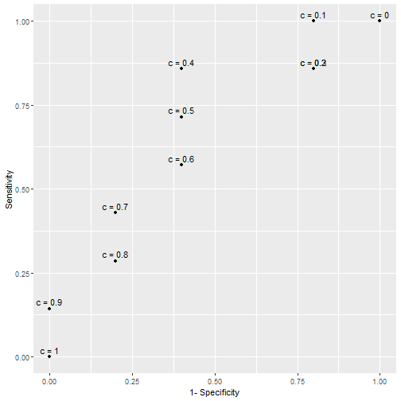
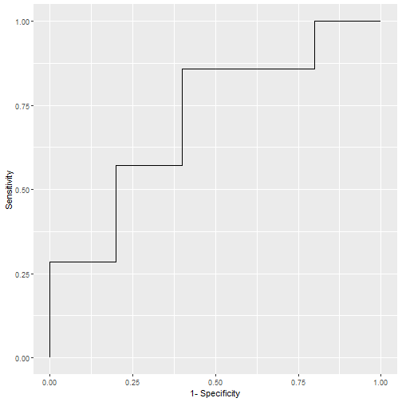
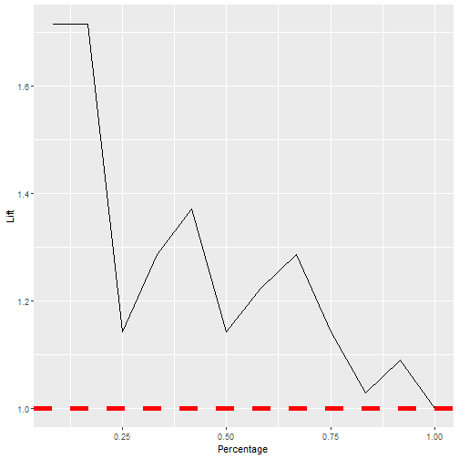
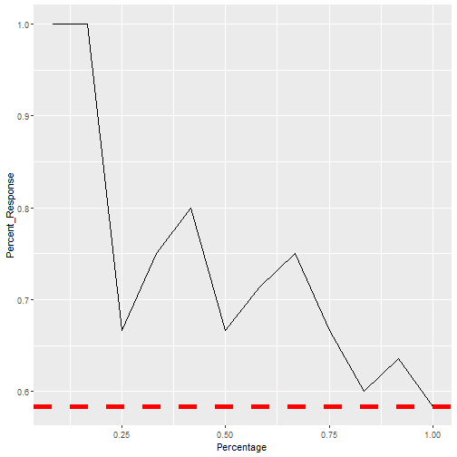

Measuring Performance in Classification Models
========================================================
author: Son Nguyen
font-family: Garamond

Reading Materials
=======================================================
- Max Kuhn. Chapter 11. 

Two outcomes of classification models
=======================================================
- Predicted Probabilities
- Class Prediction

Examples
=======================================================

- Predicting if a passenger in the titanic is survived or not survived
- The outcome could look like this. 

| Passenger ID|Probability of Survived |Prediction   |
|------------:|:-----------------------|:------------|
|            1|0.55                    |Survived     |
|            2|0.2                     |Not Survived |
|            3|0.94                    |Survived     |
|            4|0.63                    |Survived     |
|            5|0.9                     |Survived     |
|            6|0.35                    |Not Survived |
|            7|0.84                    |Survived     |
|            8|0.38                    |Not Survived |
|            9|0.01                    |Not Survived |
|           10|0.68                    |Survived     |
|           11|0.71                    |Survived     |
|           12|0.45                    |Not Survived |

Examples
=======================================================

- Notice that this model predicts "Survived" for passengers with the probabilities of being greater than 0.5
- 0.5 is called **cut-off value**. 
- The cuff-off value is set by 0.5 by default. 
- The cut-off value can be changed by the modeler. 

Confusion Matrices
=======================================================

|                 | Predicted Positive | Predicted Negative |
|-----------------|--------------------|--------------------|
| __Actual Positive__ |  True Positive (TP)         |  False Negative (FN)         |
| __Actual Negative__ |    False Positive  (FP)     |    True Negative (TN)        | 

Confusion Matrices
=======================================================

Confusion Matrices - Example
=======================================================
- "Survived" = **"Positive"**
- "Not Survived" = **"Negative"**

| Passenger ID|Probability of Survived |Prediction   |Truth        |Evaluation |
|------------:|:-----------------------|:------------|:------------|:----------|
|            1|0.55                    |Survived     |Survived     |TP         |
|            2|0.2                     |Not Survived |Survived     |FN         |
|            3|0.94                    |Survived     |Survived     |TP         |
|            4|0.63                    |Survived     |Not Survived |FP         |
|            5|0.9                     |Survived     |Survived     |TP         |
|            6|0.35                    |Not Survived |Not Survived |TN         |
|            7|0.84                    |Survived     |Not Survived |FP         |
|            8|0.38                    |Not Survived |Not Survived |TN         |
|            9|0.01                    |Not Survived |Not Survived |TN         |
|           10|0.68                    |Survived     |Survived     |TP         |
|           11|0.71                    |Survived     |Survived     |TP         |
|           12|0.45                    |Not Survived |Survived     |FN         |

Confusion Matrices
=======================================================

|                 | Predicted Positive | Predicted Negative |
|-----------------|--------------------|--------------------|
| __Actual Positive__ |  5         |  2        |
| __Actual Negative__ |    2     |    3        | 

Model evaluation from Confusion Matrices
=======================================================

|                 | Predicted Positive | Predicted Negative |
|-----------------|--------------------|--------------------|
| __Actual Positive__ |  True Positive (TP)         |  False Negative (FN)         |
| __Actual Negative__ |    False Positive  (FP)     |    True Negative (TN)        | 

$$
\begin{aligned}
\text{Misclassification Rate} &=  \frac{FN + FP}{\text{Total}} = \frac{FN + FP}{TN+TP+FN+FP} \\
\text{Accuracy} &= \frac{TN+TP}{TN+TP+FN+FP} \\
\text{Sensitivity} &= \frac{TP}{\text{Actual Positive}} = \frac{TP}{TP+FN} \\ 
\text{Specificity} & = \frac{TN}{\text{Actual Negative}} = \frac{TN}{TN+FP} \\
\text{Precision} &= \frac{TP}{TP+FP} \\
\text{F1-Score} &=2\cdot  \frac{\text{Precision} \cdot \text{Sensitivity}}{\text{Precision + Sensitivity}} = \frac{2TP}{2TP+FN+FP}

\end{aligned}
$$

Confusion Matrices
=======================================================

|                 | Predicted Positive | Predicted Negative |
|-----------------|--------------------|--------------------|
| __Actual Positive__ |  TP = 5         |  FN = 2        |
| __Actual Negative__ |   FP = 2     |    TN = 3        | 

$$
\begin{aligned}
\text{Misclassification Rate} &=4/12 \\
\text{Accuracy} &= 8/12 \\
\text{Sensitivity} &= 5/7 \\ 
\text{Specificity} & = 3/5 \\
\text{Precision} &= 5/7 \\
\text{F1-Score} &= 5/7

\end{aligned}
$$

ROC Curves
=======================================================
- Notice that all of the measures calculated in the last slide are based on the **cut-off 0.5**

- What if we change the cut-off value, **c**?

ROC Curves
=======================================================
- What is the best cut-off value?

|Cut-off Values | Sensitivity| Specificity|
|:--------------|-----------:|-----------:|
|c = 0          |   1.0000000|         0.0|
|c = 0.1        |   1.0000000|         0.2|
|c = 0.2        |   0.8571429|         0.2|
|c = 0.3        |   0.8571429|         0.2|
|c = 0.4        |   0.8571429|         0.6|
|c = 0.5        |   0.7142857|         0.6|
|c = 0.6        |   0.5714286|         0.6|
|c = 0.7        |   0.4285714|         0.8|
|c = 0.8        |   0.2857143|         0.8|
|c = 0.9        |   0.1428571|         1.0|
|c = 1          |   0.0000000|         1.0|

ROC
=======================================================
- **Question**: What is the best cut-off value?

ROC Curve
=======================================================
- **Question**: What is the best cut-off value?
- **Answer**: $c = 0.4$ is the best cut-off value

ROC Curve
=======================================================
- Each cut-off value **c** results a pair of (1-Specificity, Sensitivity) or (TP Rate, FP Rate)
- The collections of all these pairs/points for all the cut-off values is the Receiver operating characteristic Curve (ROC Curve) 

ROC Curve of the example model
=======================================================

- The curve is not very smooth because the data is very small
- With bigger data, the ROC curve will be very "smooth"

ROC Curve 
=======================================================

- The closer the curve to the point (0,1) the better the model
- The best cut-off value is at the point closest to (0,1)
- (0,1) is the **perfect point**, resulting 0 misclassification model.  
- At (0,0) the model predicts everything positive
- At (1,1) the model predicts everything negative
- The ROC of the random guess model is the diagonal 

ROC Curve 
=======================================================

- AUC = Area Under the (ROC) Curve

ROC Curve 
=======================================================

ROC Index
=======================================================
- ROC Index is the area under the ROC Curve 

ROC Index - Area Under the Curve (AUC)
=======================================================
- The closer the AUC to 1 the better the model
- The closer the AUC to 1/2 the worse the model
- Model with AUC = 1/2 is as good as a random guess or guessing by tossing a coin

- **Question**: What if the AUC less than 1/2? Are models with AUC less than 1/2 **useless**?

Another Question
=======================================================
- **Question**: Is the model with the misclassification rate of 100% the most **useless** model?

Answer
=======================================================
- **Question**: Is the model with the misclassification rate of 100% an useless model?
- *Answer*: No, by flipping the predictions of the models, one gets the **perfect model** with 0 misclassification rate. 

Back to the Question
=======================================================
- **Question**: What if the AUC less than 1/2? Are models with AUC less than 1/2 **useless**?

- **Answer**: Model with AUC less than 1/2 could be made to be better by flipping the predictions (if the model predicts positve, flip it to predict negative) 

Cumulative Lift 
=======================================================
- In the dataset, the ratio of "Survived" is 7/12 = 58.33%
- This mean that if we pick **randomly** a passenger in the this group, the chance of picking a "Survived" passenger is 58.33%
- **Question**: If we want to pick a "Survived" passenger, is there a better way than pick randomly? 

Cumulative Lift 
=======================================================
- **Question**: If we want to pick a "Survived" passenger, is there a better way than pick randomly? 
- **Answer**:  Yes, we should pick the one with the highest predictied probability.  

Cumulative Lift 
=======================================================

| Order| Predicted Probabilities| True Values|
|-----:|-----------------------:|-----------:|
|     1|                    0.94|           1|
|     2|                    0.90|           1|
|     3|                    0.84|           0|
|     4|                    0.71|           1|
|     5|                    0.68|           1|
|     6|                    0.63|           0|
|     7|                    0.55|           1|
|     8|                    0.45|           1|
|     9|                    0.38|           0|
|    10|                    0.35|           0|
|    11|                    0.20|           1|
|    12|                    0.01|           0|

- Pick randomly, "success rate" is 58.33%
- Pick the top 1, success rate is 1/1 = 100%
- We say, at 1/12 = 8.33%, the model lift is 100/58.33 = 1.71

Cumulative Lift 
=======================================================

| Order| Predicted Probabilities| True Values|
|-----:|-----------------------:|-----------:|
|     1|                    0.94|           1|
|     2|                    0.90|           1|
|     3|                    0.84|           0|
|     4|                    0.71|           1|
|     5|                    0.68|           1|
|     6|                    0.63|           0|
|     7|                    0.55|           1|
|     8|                    0.45|           1|
|     9|                    0.38|           0|
|    10|                    0.35|           0|
|    11|                    0.20|           1|
|    12|                    0.01|           0|

- Pick randomly, "success rate" is 58.33%
- Pick the top 2, success rate is 2/2 = 100%
- We say, at 2/12 = 16.67%, the model lift is 100/58.33 = 1.71

Cumulative Lift 
=======================================================

| Order| Predicted Probabilities| True Values|
|-----:|-----------------------:|-----------:|
|     1|                    0.94|           1|
|     2|                    0.90|           1|
|     3|                    0.84|           0|
|     4|                    0.71|           1|
|     5|                    0.68|           1|
|     6|                    0.63|           0|
|     7|                    0.55|           1|
|     8|                    0.45|           1|
|     9|                    0.38|           0|
|    10|                    0.35|           0|
|    11|                    0.20|           1|
|    12|                    0.01|           0|

- Pick randomly, "success rate" is 58.33%
- Pick the top 2, success rate is 2/2 = 100%
- We say, at 2/12 = 16.67%, the model lift is 100/58.33 = 1.71

Cumulative Lift 
=======================================================

| Order| Predicted Probabilities| True Values|
|-----:|-----------------------:|-----------:|
|     1|                    0.94|           1|
|     2|                    0.90|           1|
|     3|                    0.84|           0|
|     4|                    0.71|           1|
|     5|                    0.68|           1|
|     6|                    0.63|           0|
|     7|                    0.55|           1|
|     8|                    0.45|           1|
|     9|                    0.38|           0|
|    10|                    0.35|           0|
|    11|                    0.20|           1|
|    12|                    0.01|           0|

- Pick randomly, "success rate" is 58.33%
- Pick the top 3, success rate is 2/3 = 66.66%
- We say, at 3/12 = 25%, the model lift is 66.66/58.33 = 1.14

Cumulative Lift 
=======================================================

| Order| Predicted Probabilities| True Values|
|-----:|-----------------------:|-----------:|
|     1|                    0.94|           1|
|     2|                    0.90|           1|
|     3|                    0.84|           0|
|     4|                    0.71|           1|
|     5|                    0.68|           1|
|     6|                    0.63|           0|
|     7|                    0.55|           1|
|     8|                    0.45|           1|
|     9|                    0.38|           0|
|    10|                    0.35|           0|
|    11|                    0.20|           1|
|    12|                    0.01|           0|
- Pick randomly, "success rate" is 58.33%
- Pick the top 4, success rate is 3/4 = 75%
- We say, at 4/12 = 25%, the model lift is 75/58.33 = 1.28

Cumulative Lift 
=======================================================

| Percentage|     Lift|
|----------:|--------:|
|  0.0833333| 1.714286|
|  0.1666667| 1.714286|
|  0.2500000| 1.142857|
|  0.3333333| 1.285714|
|  0.4166667| 1.371429|
|  0.5000000| 1.142857|
|  0.5833333| 1.224490|
|  0.6666667| 1.285714|
|  0.7500000| 1.142857|
|  0.8333333| 1.028571|
|  0.9166667| 1.090909|
|  1.0000000| 1.000000|

Cumulative Lift 
=======================================================

Cumulative % Response 
=======================================================

| Percentage| Percent_Response|
|----------:|----------------:|
|  0.0833333|        1.0000000|
|  0.1666667|        1.0000000|
|  0.2500000|        0.6666667|
|  0.3333333|        0.7500000|
|  0.4166667|        0.8000000|
|  0.5000000|        0.6666667|
|  0.5833333|        0.7142857|
|  0.6666667|        0.7500000|
|  0.7500000|        0.6666667|
|  0.8333333|        0.6000000|
|  0.9166667|        0.6363636|
|  1.0000000|        0.5833333|

Cumulative % Response 
=======================================================

