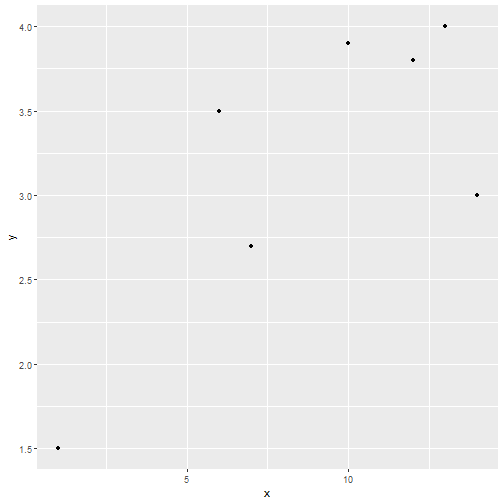

## Overfitting and Model Tuning

author: Son Nguyen
font-family: Garamond

## Reading Materials

- Max Kuhn. Chapter 4. 

## Prediction Problem

Given data of $X = [X_1, X_2, ..., X_d]$ and $Y$. Find the relation between $X$ and $Y$. 

## Prediction Problem - Examples

- One Input Variable $X$

| X    | Y   |
|----|----|
| 13  | 4.0  |
| 6  | 3.5 |
| 14 | 3  |
| 10 | 3.9 |
| 7  | 2.7 |
| 12 | 3.8 |
| 1 | 1.5 |

How are $X$ and $Y$ related?

## Prediction Problem - Examples

- Multiple Input Variables

| $X_1$ | $X_2$ | ... | $X_{35}$ | $Y$ |
|-----|-----|-----|-----|---|
| 1     | -1    | ...    |  2   | Tree  |
|  2.1   |    0 |   ...  |    6 | Not a Tree  |
|   3  |     0| ...    |    8 | Tree  |

How are $X$ and $Y$ related?

## Prediction Problem

- If $Y$ is continous, we have a **regression** problem.
- If $Y$ is categorical, we have a **classification** problem.
- If $Y$ is binary, we have a **binary classification** problem.

## Prediction Problem - Examples

- This is a regression problem since $Y$ is continuous. 

| X    | Y   |
|----|----|
| 13  | 4.0  |
| 6  | 3.5 |
| 14 | 3  |
| 10 | 3.9 |
| 7  | 2.7 |
| 12 | 3.8 |
| 1 | 1.5 |

## Prediction Problem - Examples

- This is a binary classification Problem since $Y$ is binary. 

| $X_1$ | $X_2$ | ... | $X_{35}$ | $Y$ |
|-----|-----|-----|-----|---|
| 1     | -1    | ...    |  2   | Tree  |
|  2.1   |    0 |   ...  |    6 | Not a Tree  |
|   3  |     0| ...    |    8 | Tree  |

## Overfitting

- Consider the data:

| X    | Y   |
|----|----|
| 13  | 4.0  |
| 6  | 3.5 |
| 14 | 3  |
| 10 | 3.9 |
| 7  | 2.7 |
| 12 | 3.8 |
| 1 | 1.5 |

- We will fit these data by polynomial model. 
- In polynomial model, $Y$ is a polynomial function of $X$. 

## Overfitting

- We will fit these data by **polynomial model**. 
- In polynomial model, $Y$ is a polynomial function of $X$. 

## Overfitting -  Polynomial Model

- In polynomial model, we need to specify the degree of the polynomial, $n$.  Let try a few. 
- If $n=1$, we have a familiar **linear model**. 
- **Question: Does increasing $n$ resuls in a better model?**

## Overfitting -  Polynomial Model

- $n=1$. 

## Overfitting -  Polynomial Model

- $n=2$. 

## Overfitting -  Polynomial Model

- $n=3$. 

## Overfitting -  Polynomial Model

- $n=4$. 

## Overfitting -  Polynomial Model

- $n=5$. 

## Overfitting -  Polynomial Model

- $n=6$. 

## Overfitting -  Polynomial Model

- **Question**: What are the errors when $n>6$?

## Overfitting -  Polynomial Model

- **Question**: What are the errors when $n>6$?
- **Answer**: The errors are all zeros. (There are actually many solutions for each degree greater than 6.) 

## Overfitting -  Polynomial Model

- **Question**: What is the best model? 

## Overfitting -  Polynomial Model

- **Question**: What is the best model? 
- **Answer**: We do not know.  We need a validation dataset to validate the models. 

## Overfitting -  Polynomial Model

- The errors we have seen are called **training errors**

## Overfitting -  Polynomial Model

- Let's validate these models with a validation dataset
- Validation Data

| X    | Y   |
|----|----|
| 5  | 2.6  |
| 7  | 3.5 |
| 9 | 4.0  |
| 6 | 3.7 |
| 12  | 5.0 |

## Overfitting -  Polynomial Model

- $n=1$. 

## Overfitting -  Polynomial Model

- $n=2$. 

## Overfitting -  Polynomial Model

- $n=3$. 

## Overfitting -  Polynomial Model

- $n=4$. 

## Overfitting -  Polynomial Model

- $n=5$. 

## Overfitting -  Polynomial Model

- $n=6$. 

## Overfitting -  Polynomial Model

- Training Error vs. Validation Error

|   | Training Error | Validation Error |
|---|----------------|---------------|
| $n=1$  | 0.4443277      | 3.726484      |
| $n=2$  | 0.2104958      | 2.304728      |
| $n=3$  | 0.1724256      | **1.955191 (Best!)**      |
| $n=4$  | 0.08719074     | 2.515661      |
| $n=5$  | 0.05131475     | 5.987636      |
| $n=6$  | 0              | 18.24475      |

## Overfitting -  Polynomial Model

- Training Error vs. Validation Error

## Overfitting -  Polynomial Model

- As the degree $n$ increases, the training errors decrease
- Model 6 ($n=6$) is the best (perfect) in training but the worst in validation.  
- The best model is the model with the best (lowest) error in **validation data**.

Overfitting -  Polynomial Model
##
- Model 4, 5 and 6 are **overfitted**
- Model 1 and 2 are **underfitted**
- Model 3 is the best model. 

## Overfitting in Regression

## Overfitting in Classification

## Model Complexity/Capacity

- In polynomial models, the larger $n$, the more complex/capable the model. 

- Model complexity can be measured by the number of parameters/unknown of the model. 

## Model Complexity/Capacity

- Linear model: 

$$
y = ax+b
$$

- **Question**: How many unknowns/parameters in linear model?

## Model Complexity/Capacity

- Linear model $(n=1)$: 

$$
y = ax+b
$$

- **Question**: How many unknowns/parameters in linear model?
- **Answer**: Two unknowns/paramters: $a$ and $b$

## Model Complexity/Capacity

- Quadratic model $(n=2)$: 

$$
y = ax^2+bx+c
$$

- Three unknowns: $a$, $b$, and $c$. 
- Quadratic model has **more unknowns/parameters** then linear model. Thus, quadratic model is **more complex** than linear model

## Model Complexity/Capacity

- The mode complex the model, the easier it becomes overfitted! 

## Model Complexity/Capacity

## Model Tuning

- We just "tuned" the the parameter $n$. 
- The parameter $n$ is called **tuning parameter**, or **hyperparameter**

## Model Tuning

- Model tuning is the process of finding the **best** values for the tuning parameters of the model
- This is done through **trying out** many values for the tuning parameters then select the best values. 

## Model Training

- Model training is the process of finding the unknown/parameters of the model
- **Example**:  Training linear model $y= ax+b$ is to find $a$ and $b$ that best fit the data

## Model Training vs. Model Tuning

- Model training finds the **parameters**
- Model tuning finds **hyperparameters**

## Model vs. Family of Models

- The polynomial model is a **family** of models.   
- Linear model is just **one** model
- A family of models has "tuning parameters". 
- A single model, say, linear model, does not have tuning parameter
- Some model has multiple tuning parameters. 

## Data Splitting

- We need validation data for model tuning.
- **Question**: How can one of obtain validation data? 

## Data Splitting

- We need validation data for model tuning.
- **Question**: How can one of obtain validation data? 
- **Answer**:  We do not use the entire data to train models. We use a portion of it for training and save data for validation and testing. 

## Data Splitting:  Train-Validation-Test

## k-folds Cross Validation

## k-folds Cross Validation

## k-folds Cross Validation and test

